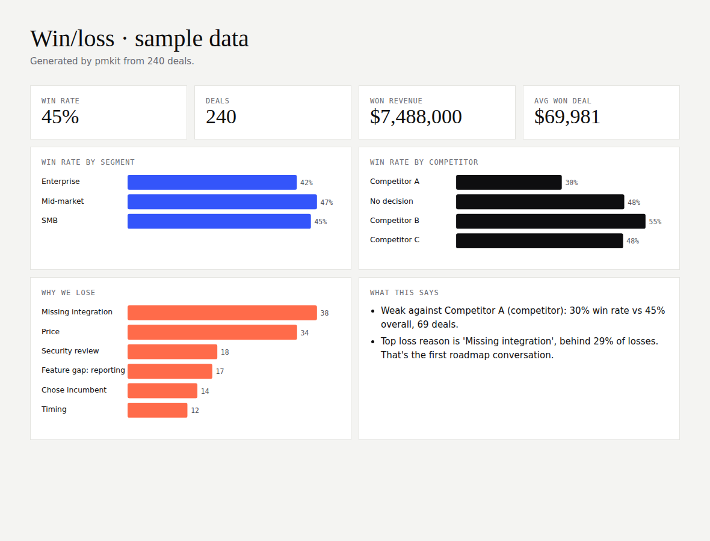

# pmkit

**Small, honest tools for product managers.** Three commands for three moments in a PM's week: deciding what to build, writing it down, and learning from the deals you won and lost.

```bash
pip install -e .
pmkit rice examples/backlog.csv        # rank the backlog, flag close calls
pmkit prd examples/brief.json          # render a PRD and lint it
pmkit winloss examples/deals.csv       # single-file win/loss dashboard
```

All example data is synthetic. See [`examples/README.md`](examples/README.md).

---

## `pmkit rice`: RICE that tells you how fragile the ranking is

A RICE score looks precise, but confidence is usually a guess. So pmkit also asks: **how much more confidence would each item need to move up one place?** If the answer is a few points, the ranking is a coin flip, and the right move is a cheap experiment, not a roadmap slot.

```
| # | Item                          | Reach | Impact | Conf. | Effort |    RICE | Conf. to move up        |
|---|-------------------------------|------:|-------:|------:|-------:|--------:|-------------------------|
| 1 | Smart onboarding checklist    | 4,000 |      2 |   80% |      2 | 3,200.0 | leader                  |
| 2 | Slack alerts for failed syncs |   900 |      2 |  100% |      1 | 1,800.0 | not on confidence alone |
| 3 | Dark mode                     | 8,000 |    0.5 |   90% |      2 | 1,800.0 | 90% (+0%) ⚠ close call  |
| 5 | AI summary of weekly activity | 6,000 |      1 |   50% |      4 |   750.0 | 72% (+22%)              |
```

Dark mode and Slack alerts are tied, so a single conversation with customers should settle #2. The AI summary needs 22 points of confidence to climb, which is a prototype and a usability test away.

CSV columns: `name, reach, impact, confidence, effort`. Impact accepts `massive | high | medium | low | minimal` or a number. Confidence accepts `80%` or `0.8`.

## `pmkit prd`: a PRD from a brief, with the review built in

Write the brief as JSON (problem, users, goals, metrics, scope, out of scope, risks) and pmkit renders a clean markdown PRD. It also lints the brief for the comments every reviewer leaves:

- **Metrics with no target number.** "Happier users" is not a metric.
- **Vague words** in the problem or goals: *seamless, intuitive, fast, robust, improve*. Say how much, for whom, by when.
- **Scope without an out-of-scope list**, which invites creep.
- **More than three goals**, which means none of them is really a goal.
- **Missing sections.**

```bash
pmkit prd brief.json --lint-only   # exits 1 if there are issues, handy in CI for a docs repo
```

## `pmkit winloss`: where you win, where you lose, and why

Point it at a deals export (`segment, competitor, amount, outcome, reason`) and it writes a single HTML file with win rate by segment and by competitor, loss reasons, and plain-language findings:

```
· Weak against Competitor A (competitor): 30% win rate vs 45% overall, 69 deals.
· Top loss reason is 'Missing integration', behind 29% of losses. That's the first roadmap conversation.
```



Findings only appear when a slice has at least 5 deals and differs from the overall win rate by 12 points or more, so it doesn't send you chasing noise.

## Why I built this

Most PM tooling is either a spreadsheet template or a platform you have to buy. These are the checks I run by hand anyway, turned into code so they're fast, repeatable and easy to argue with.

## Develop

```bash
pip install -e ".[dev]" && pytest -q   # 6 tests, no runtime dependencies
```

---

Built by [Murtuza Mohammed](https://murtuzabuilds.com). MIT licensed.
